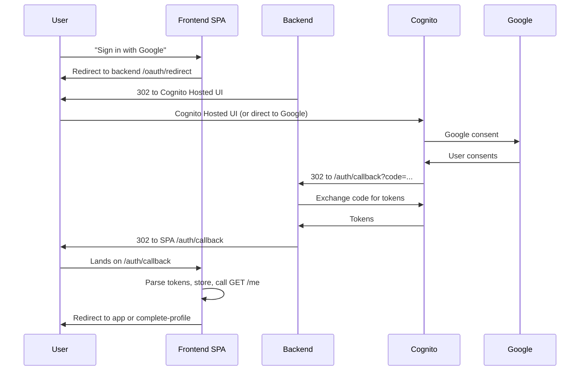

# Custom Auth UI Plan – Replace Cognito Hosted UI

This document describes the plan to replace the Cognito Hosted UI with a fully custom auth experience in the React frontend. It is intended for the **backend team** to implement the required changes.

**Goal:** Users never see Cognito’s Hosted UI. They only see the custom React login/sign-up/complete-profile screens and, for Google sign-in, Google’s native consent screen.

---

## Backend changes – summary

**Scope: small.** The backend keeps its existing token exchange logic. The only change is how the OAuth callback returns tokens to the browser.

| Change | Effort | Description |
|--------|--------|--------------|
| 1. Callback redirect behavior | 1 change | After exchanging code for tokens, redirect to the frontend with tokens in the URL instead of returning HTML/JSON. |
| 2. New env var | 1 config | Add `FRONTEND_URL` (or equivalent) so the backend knows where to redirect. |
| 3. Cognito config | 1 update | Add the frontend callback URL to Cognito’s “Allowed callback URLs”. |

---

## 1. Callback redirect behavior

**Current behavior**

- `GET /api/v1/auth/callback?code=...&state=...` receives the OAuth callback from Cognito.
- Backend exchanges `code` for tokens.
- Backend returns HTML or JSON with tokens. The user stays on the backend URL.

**New behavior**

- Same flow: receive `code`, exchange for tokens.
- Instead of returning HTML/JSON, do an **HTTP 302 redirect** to the frontend with tokens in the URL fragment. Format:

```
{FRONTEND_URL}/auth/callback#access_token={access_token}&refresh_token={refresh_token}&token_type=Bearer&expires_in={expires_in}
```

**Example**

- `FRONTEND_URL` = `https://app.example.com`
- Redirect: `https://app.example.com/auth/callback#access_token=eyJ...&refresh_token=...&token_type=Bearer&expires_in=3600`

**Fragment parameters**

- `access_token` (required)
- `refresh_token` (optional)
- `token_type` (optional, default `Bearer`)
- `expires_in` (optional)

**Security**

- Tokens in the fragment are not sent to the server; they stay in the browser.
- This is the standard pattern for OAuth implicit/SPA flows.

---

## 2. New env var

Add a `FRONTEND_URL` (or `FRONTEND_ORIGIN`) env var so the backend can build the redirect URL.

| Env var | Example | Required |
|---------|---------|----------|
| `FRONTEND_URL` | `https://app.example.com` | Yes |

**Usage**

- Build redirect URL: `{FRONTEND_URL}/auth/callback#access_token=...&refresh_token=...`
- Use in CORS config if needed.

**Infra**

- Backend stack should expose `FrontendUrl` (or similar) so the backend can read it at runtime.
- For local dev, set `FRONTEND_URL=http://localhost:3000`.

---

## 3. Cognito configuration

**Allowed callback URLs**

- Cognito must allow the callback URL.
- Current: `{BACKEND_URL}/api/v1/auth/callback` (backend receives code).
- No change needed here: Cognito still redirects to the backend with the code.
- The backend then redirects to the frontend with tokens in the fragment.

**Optional**

- If you want the frontend URL in Cognito for other flows, add it. For this plan, the backend redirect is sufficient.

---

## 4. Flow diagram



**Note:** Cognito Hosted UI may still appear briefly in the redirect chain. To minimize it, use `identity_provider=Google` in the OAuth URL so Cognito skips to Google’s consent screen directly. The main improvement is that users never land on Cognito’s page; they end on the custom frontend after sign-in.

---

## 5. Frontend changes (for reference)

The frontend already supports this flow:

- `AuthCallback` page at `/auth/callback` reads `access_token` and `refresh_token` from the URL hash.
- It calls `setSessionFromTokens(accessToken, refreshToken)`.
- Auth context then calls `GET /auth/me` and routes to the app or complete-profile.

**No frontend changes** are required once the backend redirects as described above.

---

## 6. Contract update

Add to [AUTH_AND_PROFILE_CONTRACT.md](./AUTH_AND_PROFILE_CONTRACT.md) (or equivalent):

**OAuth callback behavior**

- After exchanging the code for tokens, the backend **must** redirect the browser to:
  `{FRONTEND_URL}/auth/callback#access_token={access_token}&refresh_token={refresh_token}&token_type=Bearer&expires_in={expires_in}`
- The frontend expects the `access_token` (and optionally `refresh_token`) in the URL fragment.

---

## 7. Checklist for backend

- [ ] Add `FRONTEND_URL` env var (from infra or config).
- [ ] Change `GET /api/v1/auth/callback` handler: after token exchange, return 302 redirect to `{FRONTEND_URL}/auth/callback#access_token=...&refresh_token=...`.
- [ ] Update contract docs if needed.
- [ ] Test with local frontend (`FRONTEND_URL=http://localhost:3000`).

---

## 8. Summary

**Are there many changes from the backend?** No.

- One change in the callback handler: redirect instead of returning HTML/JSON.
- One new env var: `FRONTEND_URL`.
- No new endpoints or auth logic changes.
