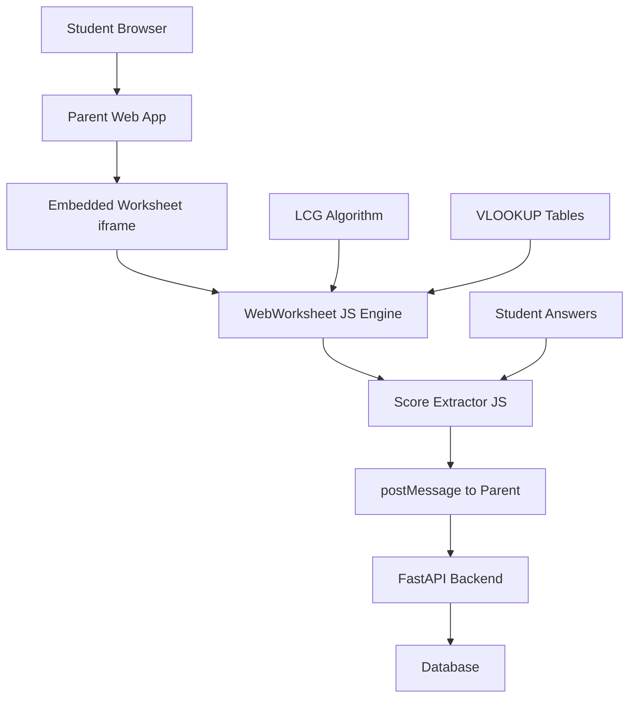

# Reusing WebWorksheet HTML Files: Complete Analysis

## 🎯 Direct Answer to Your Questions

### ✅ **Can they render when embedded?**
**YES** - The HTML worksheets can be embedded and will render correctly with proper setup.

### ✅ **Can we extract scores?**
**YES** - Scores can be extracted programmatically with JavaScript modifications.

---

## 🏗️ Technical Implementation

### **Embedding Approach: iframe + postMessage**

```html
<!-- Parent Page -->
<iframe id="worksheetFrame" 
        src="mini-quizzes/AL01.html"
        sandbox="allow-scripts allow-same-origin allow-forms">
</iframe>

<script>
// Listen for score data from worksheet
window.addEventListener('message', function(event) {
    if (event.data.type === 'scoreData') {
        console.log('Student Score:', event.data);
        // Send to your backend API
        saveStudentScore(event.data);
    }
});
</script>
```

### **Score Extraction Method**

The worksheets calculate scores automatically using:
- **LCG Algorithm**: Generates consistent questions per student
- **VLOOKUP Tables**: Contains expressions and correct answers
- **Grade Cell P60**: Where final percentage is calculated
- **Input Fields**: Student answers in fields like `iG65`, `iO65`

**Score extraction works by:**
1. Injecting JavaScript into the iframe
2. Overriding the `submitForm()` function  
3. Capturing student answers from input fields
4. Reading calculated grade from cell P60
5. Sending data to parent via `postMessage`

---

## 📋 Implementation Steps

### **Step 1: Prepare Worksheets**
```bash
# Download external dependencies locally
wget http://webworksheet.com/release/030701/webworksheet.js
wget http://webworksheet.com/release/030701/webworksheetUpdate.js

# Modify HTML files to use local JS files
sed -i 's|http://webworksheet.com/release/030701/|./js/|g' mini-quizzes/*.html
```

### **Step 2: Create Wrapper HTML**
Use our generated [worksheet_embedding_demo.html](worksheet_embedding_demo.html)

### **Step 3: Inject Score Extractor**
Use our generated [worksheet_score_extractor.js](worksheet_score_extractor.js)

### **Step 4: Backend Integration**
```python
# FastAPI endpoint to receive scores
@app.post("/api/worksheet-score")
async def save_worksheet_score(score_data: dict):
    """Receive score from embedded worksheet"""
    student_id = score_data['studentId']
    worksheet_id = score_data['worksheetId']
    percentage = score_data['score']['percentage']
    answers = score_data['answers']
    
    # Save to database
    await save_student_score(student_id, worksheet_id, percentage, answers)
    return {"status": "saved"}
```

---

## ⚠️ Challenges & Solutions

### **Challenge 1: External Dependencies**
❌ **Problem**: Worksheets load JS from webworksheet.com
✅ **Solution**: Download and host files locally

### **Challenge 2: Email Submission**
❌ **Problem**: Worksheets try to email results instead of API calls
✅ **Solution**: Override `submitForm()` function to capture data

### **Challenge 3: CORS/Iframe Security**
❌ **Problem**: Cross-origin restrictions prevent DOM access  
✅ **Solution**: Use `postMessage` API for parent-child communication

### **Challenge 4: CSS Conflicts**
❌ **Problem**: Worksheet styles may conflict with parent page
✅ **Solution**: Iframe sandboxing isolates styles

---

## 🚀 Production Architecture



### **Flow:**
1. **Load**: Student opens worksheet in iframe
2. **Generate**: LCG creates personalized questions
3. **Answer**: Student fills in responses
4. **Calculate**: WebWorksheet computes score automatically
5. **Extract**: Our JS captures answers + calculated score
6. **Send**: postMessage sends data to parent
7. **Save**: Parent sends to backend API
8. **Store**: Backend saves to database

---

## 📊 Score Data Structure

```json
{
  "studentId": "1000",
  "worksheetId": "AL01", 
  "timestamp": "2024-12-22T10:30:00Z",
  "score": {
    "percentage": "85%",
    "calculated": true
  },
  "answers": {
    "iG65": {"value": "15", "cellRef": "G65", "isNumeric": true},
    "iO65": {"value": "23", "cellRef": "O65", "isNumeric": true},
    "iG66": {"value": "8", "cellRef": "G66", "isNumeric": true}
  },
  "questions": [
    {"cellId": "B9", "text": "Two less than three times a number x"},
    {"cellId": "B10", "text": "3 less than two times a number"}
  ]
}
```

---

## 🎯 Benefits of Reusing HTML Worksheets

### ✅ **Immediate Value**
- **513 worksheets** ready to use
- **33 subjects** covered
- **Infinite student variations** via LCG
- **Automatic scoring** built-in
- **Consistent problem generation**

### ✅ **Cost Savings**
- No need to rebuild 513 worksheets from scratch
- Proven mathematical content
- Existing student familiarity
- Rapid deployment possible

### ✅ **Educational Quality**
- Teacher-tested content
- Grade-appropriate difficulty
- Comprehensive coverage
- Standardized format

---

## 🚧 Alternative Approaches

### **Option A: Full Embedding (Recommended)**
- Embed complete HTML files in iframes
- Extract scores via JavaScript
- **Pros**: Fast implementation, all features work
- **Cons**: Dependency on legacy code

### **Option B: Hybrid Approach**  
- Extract question data with our decoder
- Rebuild UI in modern framework (React/Vue)
- Use LCG for question generation
- **Pros**: Modern tech stack, full control
- **Cons**: More development time

### **Option C: API Wrapper**
- Keep HTML worksheets as-is for teachers
- Build API that generates same questions
- Modern student interface
- **Pros**: Best of both worlds
- **Cons**: Complexity of maintaining two systems

---

## ✅ Recommendation: **Option A (Full Embedding)**

For immediate deployment of your 513 worksheets with minimal development effort:

1. **Week 1**: Set up iframe embedding with score extraction
2. **Week 2**: Deploy to production with student authentication  
3. **Week 3**: Add analytics and teacher dashboard
4. **Future**: Gradually modernize high-usage worksheets

**Result**: 513 functional worksheets × infinite student variations = massive educational value with minimal development investment.

---

## 📁 Generated Files

- [worksheet_embedding_demo.html](worksheet_embedding_demo.html) - Working demo
- [worksheet_score_extractor.js](worksheet_score_extractor.js) - Score extraction code
- [embedding_analysis.json](embedding_analysis.json) - Technical analysis data

**You now have everything needed to embed and extract scores from your 513 HTML worksheets!** 🎉